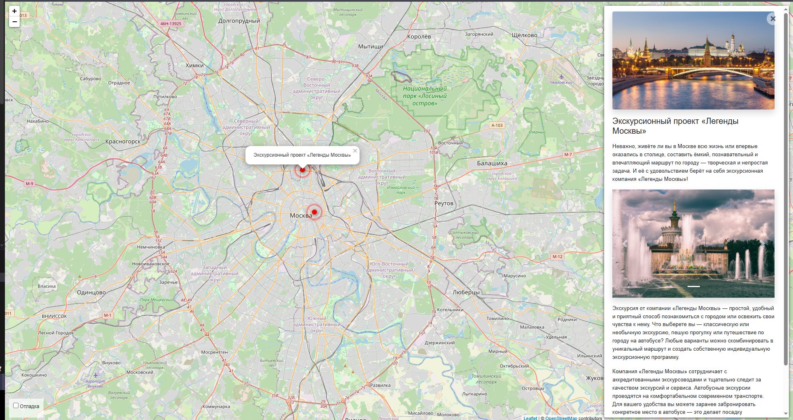

# Куда пойти — Москва глазами Артёма

Интерактивная карта с описаниями интересных мест Москвы.



## Возможности

- Просмотр локаций на интерактивной карте
- Детальные описания с HTML-форматированием
- Удобная админка для управления контентом:
  - drag-and-drop сортировка изображений
  - WYSIWYG-редактор для описаний
  - превью загруженных фото

## Технологии

- Python 3.10+
- Django 5.0
- PostgreSQL / SQLite (для разработки)
- Leaflet.js + Vue.js (фронтенд)
- Bootstrap 4
- `django-admin-sortable2`
- `django-tinymce`
- `environs` для безопасных настроек

## Запуск локально

1. Установите зависимости:
   ```bash
   pip install -r requirements.txt
    ```

2. Создайте .env файл (пример в .env.example):
    ```bash
    SECRET_KEY=ваш_секретный_ключ
    DEBUG=True
    ALLOWED_HOSTS=127.0.0.1,localhost
    ```

3. Выполните миграции и запустите сервер:
   ```bash
    python manage.py migrate
    python manage.py createsuperuser
    python manage.py runserver
    ```

4. Откройте http://127.0.0.1:8000

## Загрузка данных

Для загрузки локации из JSON-файла выполните:

```bash
python manage.py load_place https://raw.githubusercontent.com/devmanorg/where-to-go-places/master/places/moscow_legends.json       